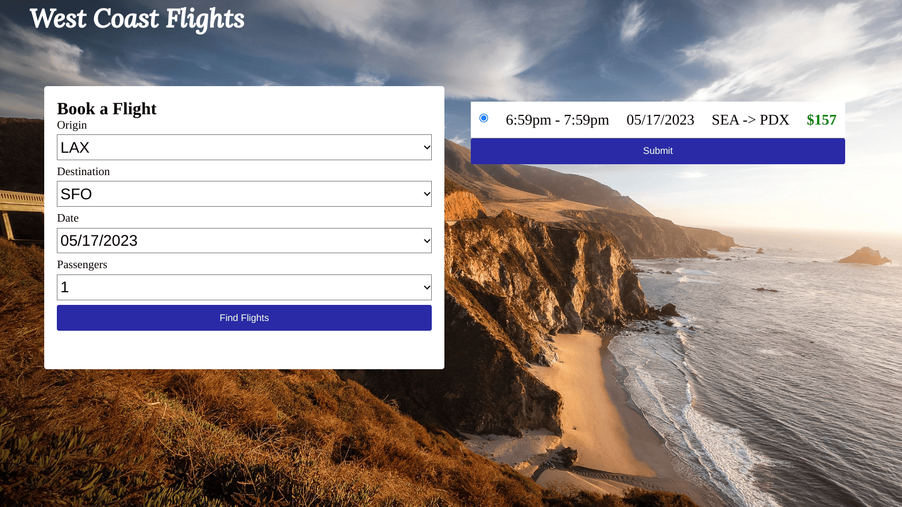

# Flight Booker

This is my implementation of the Flight Booker project from the [The Odin Project](https://www.theodinproject.com/lessons/ruby-on-rails-flight-booker).

[Click here to visit the site](https://westcoastflights.up.railway.app/)

 

## Project Requirements

The goal of this project is to build a site which allows users to book a one-way flight.

**Features**

- Allows users to search for flights from dropdown menus from forms prepopulated with collections of data.

- Uses nested forms to allow for multiple passengers on a single booking.

- Allows users to make a payment with the Stripe API. To prevent users from being charged, Stripe API keys are in test mode. You can enter in the card info below to try it out!  

Card number: 4242 4242 4242 4242  
Date: 12/34  
CVC: 123  

## Getting Started

**Prerequisites**  
Ruby >= 3.1.2  
Rails >= 7.0.4  
PostgreSQL >= 13.9  

**Installation**  
`git clone https://github.com/danielvec/flight-booker/`  
`cd flight-booker`  
`bundle`  
`rails db:create`  
`rails db:migrate`  
`rails db:seed`  
`rails s`  
https://localhost:3000/

**Rspec Tests**

To run the tests, enter:  
`rspec`